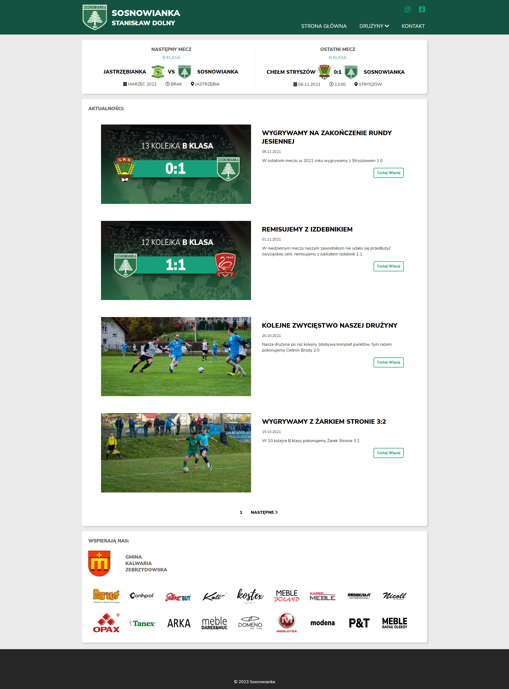
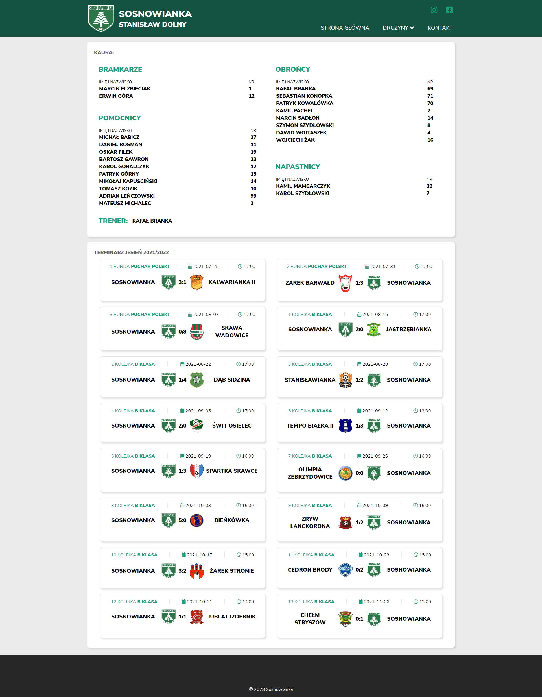
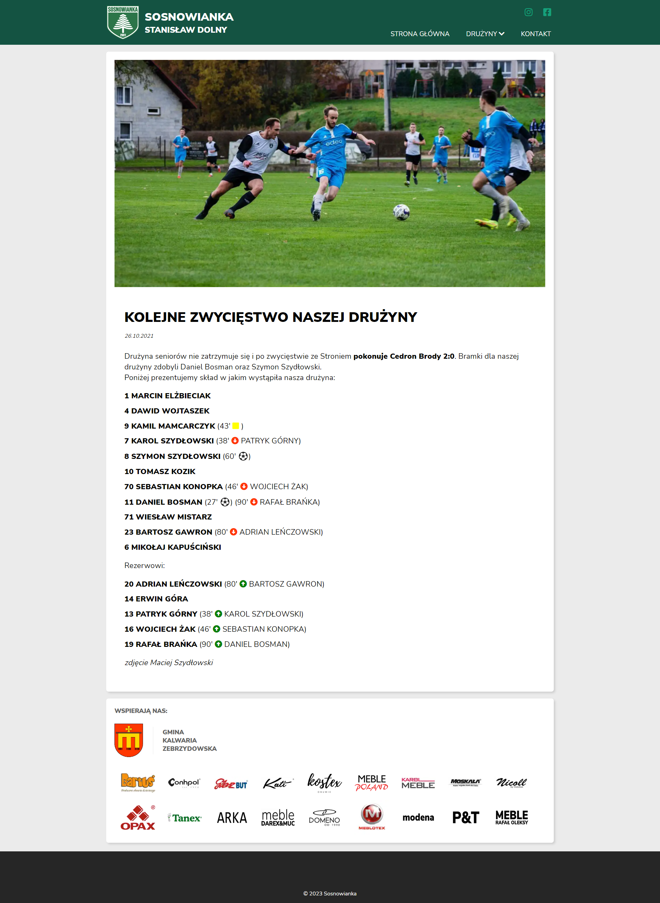

# Sosnowianka - news website for football club

This is a news website created with Gatsby and Netlify CMS.

## Table of contents

- [Overview](#overview)
  - [About](#about)
  - [Screenshot](#screenshot)
  - [Links](#links)
- [My process](#my-process)
  - [Built with](#built-with)
  - [What I learned](#what-i-learned)
- [Author](#author)
- [Acknowledgments](#acknowledgments)

## Overview

### About

On this website admin should be able to add:

- Posts with photos
- Team schedule
- Team roster
- Scores and next games
- List of sponsors

### Screenshot

### Links

- Live Site URL: [Live Stite](https://sosnowianka.netlify.app/)

## My process

### Built with

- Gatsby JS
- Styled-components
- Netlify CMS
- Adobe XD

### What I learned

This project was my first step to learn gatsby, styled-components and Netlify CMS. I was learning by doing, after all I learned a lot new things

## Author

- Website - [Dawid Wojtaszek](https://dawidwojtaszek.pl/)

## Acknowledgments

I learned a lot about gatsby from [_this tutorial_](https://www.youtube.com/watch?v=Qms4k6y7OgI&list=PL4cUxeGkcC9hw1g77I35ZivVLe8k2nvjB) by The Net Ninja
